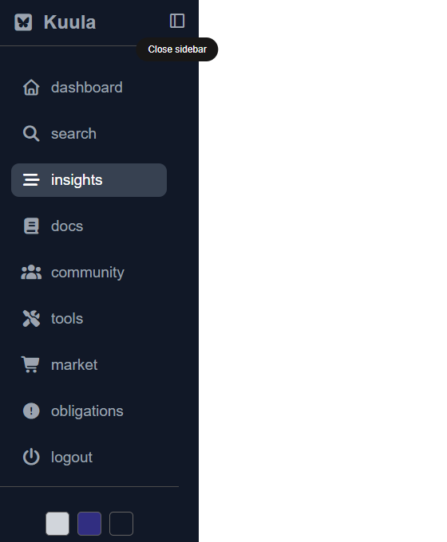
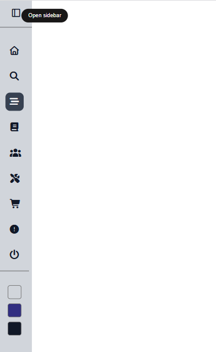
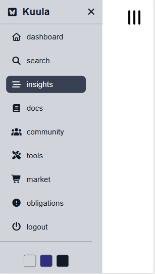

## Responsive Sidebar
A modern and responsive sidebar built with HTML, CSS, and JavaScript.
This project focuses on creating a clean dashboard navigation experience with interactive sidebar controls, themes, persistence, and responsive behavior.
## ✨ Features
  - Fully responsive sidebar
  - ↔ Collapse and expand sidebar  
  -  Sidebar state saved with localStorage
  - multicolor theme support
  - Theme preference saved with localStorage
  - Tooltip for sidebar controls
  - Responsive mobile menu
  - Clean and modern UI
  -  Smooth transitions and interactions
 ## 🛠️ Built With
  +	HTML5
  +	CSS3
  +	JavaScript
  +	Font Awesome
  +	LocalStorage API
  ## 📌 What I Practiced
**Through this project, I practiced:**
*	DOM manipulation
*	JavaScript event listeners
*	CSS transitions
*	Responsive design
*	CSS variables
*	Toggle functionality
*	localStorage
## 📷 Preview 

    

### 🌐 Live Demo
[View Live Demo](https://advanced-sidebar.vercel.app/)

### 👨‍💻 Author
**Kafisa Aymoi**

